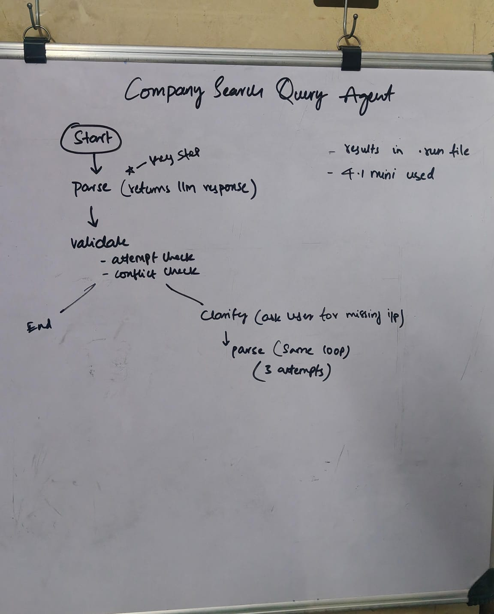

# Company Search Query Agent



A LangGraph agent that converts natural-language business directory queries into structured, validated filters — and asks follow-up questions when the input is too vague or conflicting.

---

## What it does

Oueries:

> *"Find me plumbing companies in Texas with more than 5 employees that have a website"*

And the agent turns it into:

```json
{
  "industry": "plumbing",
  "location": "Texas",
  "size_range": { "min": 6, "max": null },
  "required_attributes": ["website"],
  "optional_attributes": [],
  "reasoning": "..."
}
```

If your query is vague or contradictory, it asks a follow-up question and re-parses with your answer.

---

## Graph

```
START → parse → validate → END
                   ↓
                clarify → parse (loop, capped at 2 attempts)
```

Three nodes, two LLM calls max per round:

| Node | LLM? | What happens |
|------|------|--------------|
| `parse` | yes | maps query → structured `ParsedQuery` |
| `validate` | no | checks industry + location + no conflicts |
| `clarify` | yes | generates a follow-up question, waits for your input |

---

## Setup

```bash
# install uv (if you don't have it)
curl -LsSf https://astral.sh/uv/install.sh | sh

# create virtualenv and install deps
uv venv .venv --python 3.11
source .venv/bin/activate
uv pip install langgraph langchain-openai pydantic python-dotenv
```

Add your key to `.env`:
```
OPENAI_API_KEY=sk-...
```

Run:
```bash
python main.py
```

---

## Design decisions

**1. Structured output over raw JSON parsing**

The LLM is bound to the `ParsedQuery` Pydantic schema via `with_structured_output()`. This uses OpenAI's function calling under the hood — the model is forced to return valid, schema-conforming JSON at the API level. No `json.loads()`, no crashes on empty or markdown-wrapped responses.

**2. Moved from gpt-4o-mini to gpt-4.1-mini**

During testing, `gpt-4o-mini` consistently confused two distinct failure modes — a contradictory query (e.g. "Fortune 500 with under 10 employees") and an incomplete query (e.g. missing industry). It would sometimes flag contradictions as just vague, skipping the CONFLICT path entirely. `gpt-4.1-mini` handles this distinction reliably.

**3. Three-node graph, no extra complexity**

Parse, validate, clarify — that's it. Validation is pure Python (no LLM), which keeps it deterministic and cheap. The retry cap is 2 attempts: one clarification round, then force-pass. Keeps the agent from looping forever on genuinely unanswerable queries.

**4. Reasoning field**

Every parsed result includes a `reasoning` string — the model's brief explanation of why each field was set the way it was. Useful for manually spot-checking whether the model understood the query correctly, without having to reverse-engineer the output.

---

## Run artifacts

Every run is saved to `.runs/<timestamp>.json` for inspection:

```json
{
  "input": "...",
  "result": { ... },
  "valid": true,
  "attempts": 1
}
```
